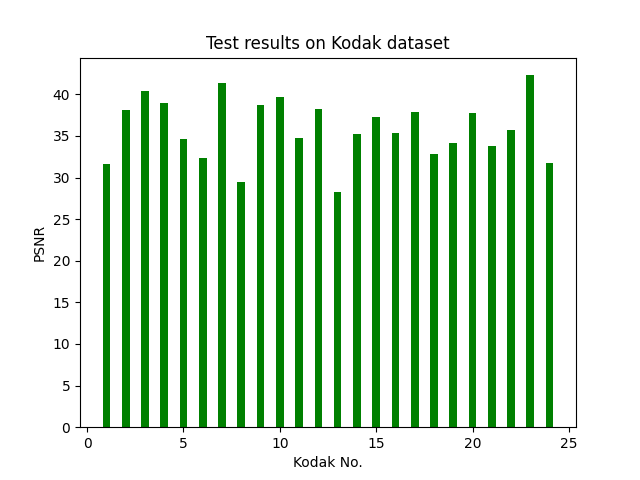
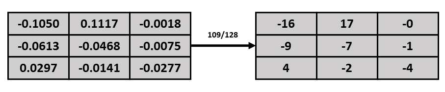

# Fixed-point Convolution Framework
## Introduction
We propose a fixed-point convolution strategy based on the distribution characteristics of activation values. Firstly, the floating-point model is pre-trained until it converges. Then, the activation values are limited according to its own distribution characteristics in each convolution layer. Finally, the activation values are converted into fixed-point forms, and the weights are quantized into low bit-width integers. Since floating-point operations are not involved in the forward inference process, but only fixed-point operations with low bit-width are involved, the instability of floating-point operations on different hardware architectures can be avoided, and calculations can also be accelerated.

## Architecture

## Scirpts

We provide three Python scripts with the following functions:

+ [transform_model.py](./scripts/transform_model.py): decomposing the **fixed-point model** (lrs_fixed.pth) into **integer model** (lrs_integer.pth) and corresponding **range factors** (range.npy).
+ [test_single.py](./scripts/test_single.py): testing model on one image.
+ [test_kodak.py](./scripts/test_kodak.py): testing model on Kodak dataset.

## Models

We provide two models, which are generated as follows:

+ [lrs_float.pth](./models/lrs_float.pth): floating-point model.
+ [lrs_fixed.pth](./models/lrs_fixed.pth): fixed-point model that will be decomposed into range.npy and lrs_integer.pth.

## Steps

The two Python scripts we provide are used as follows:

+ python transform_model.py
+ python test_single.py or python test_kodak.py

+ [lrs_integer.pth](./models/lrs_integer.pth): fixed-point model whose weights and biases are integers.

## Result

Value of lrs_integer.pth to be shown below:

**TODO**
