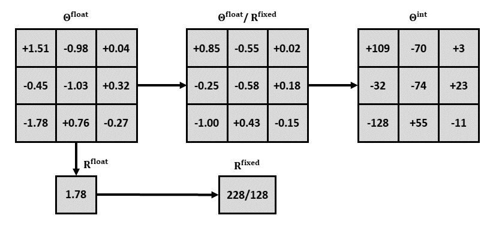

# Fixed-point Convolution Framework
## Introduction
We propose a fixed-point convolution strategy based on the distribution characteristics of activation values. 
We first propose to perform the activation range pre-processing by constraining its dynamic range into a limited scope, of which we re-train the original floating-point model till the convergence with decent trade-off balance. 
Upon this re-trained floating-point model with limited activation range, we have then developed the range-adaptive quantization, linear scaling, and range-dependent normalization to replace the default floating-point weights, biases, and activations involved in native floating-point convolutions, and exponential computations (e.g.,sigmoid, softmax-based normalization), into the fixed-point presentation. 
The “range” used here can be represented by a scalar that is fixed for pre-processing, learned for quantization, and  adapted for normalization, in neural model for indicating the dynamic range of the processing data for compact data presentation. 
Since floating-point operations are not involved in the forward inference process, but only fixed-point operations with low bit-width are involved, the instability of floating-point operations on different hardware architectures can be avoided, and calculations can also be accelerated.

## Architecture

After the floating-point convolution kernel is decomposed into a same-size integer convolution kernel and a fixed-point range parameter, the original floating-point convolution layer is divided into two layers: the first layer is a similar fixed-point convolution layer, and the second layer is a linear scaling layer. 
The calculation process is shown in the figure below:

## Scirpts

We provide three Python scripts with the following functions:

+ [transform_model.py](./scripts/transform_model.py): decomposing the **fixed-point model** (lrs_fixed.pth) into **integer model** (lrs_integer.pth) and corresponding **range factors** (range.npy).
+ [test_single.py](./scripts/test_single.py): testing model on one image.
+ [test_kodak.py](./scripts/test_kodak.py): testing model on Kodak dataset.

## Models

We provide two models, which are generated as follows:

+ [lrs_float.pth](./models/lrs_float.pth): floating-point model.
+ [lrs_fixed.pth](./models/lrs_fixed.pth): fixed-point model that will be decomposed into range.npy and lrs_integer.pth.

## Steps

The two Python scripts we provide are used as follows:

+ python transform_model.py
+ python test_single.py or python test_kodak.py

+ [lrs_integer.pth](./models/lrs_integer.pth): fixed-point model whose weights and biases are integers.

## Result

Value of lrs_integer.pth to be shown below:

**TODO**
